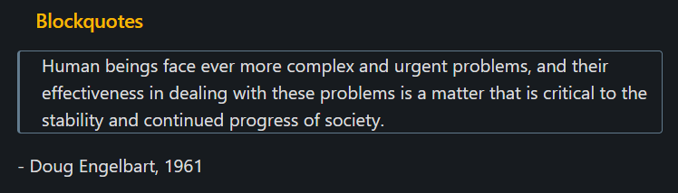

# Mammoth

I really don't want to make this theme. I just want things to look nice. But, ya know, my _specific_ type of nice.
Mammoth is a dark theme for the note-taking app [Obsidian](https://obsidian.md). It's been designed and used primarily with, at most, 3 notes on screen.

## Features
✔ Supports the [Todoist](https://github.com/jamiebrynes7/obsidian-todoist-plugin) plugin

✔ Fun colors!

❌ Is an extinct mammal :(

## Overview

## Examples
- [Todoist](#Todoist)
- [Blockquotes](#Blockquotes)
- [Headers](#Headers)
- [Codeblocks](#Codeblocks)

## Headers

## Todoist

## Blockquotes

## Codeblocks

