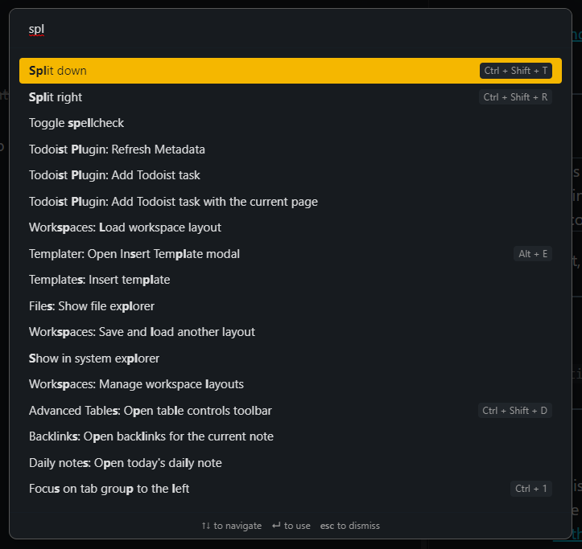

# Mammoth

I really don't want to make this theme. I just want things to look nice. But, ya know, my _specific_ type of nice.
Mammoth is a dark theme for the note-taking app [Obsidian](https://obsidian.md). It's been designed in mind for - and used primarily with - 3 vertical panes while fullscreened.

## Features
~~✔ Supports the [Todoist](https://github.com/jamiebrynes7/obsidian-todoist-plugin) plugin~~ Broken in v1.0. Will be fixed later.

✔ Fun colors!

❌ Is an extinct mammal :(

## Examples
- [Todoist](#Todoist)
- [Headers](#Headers)
- [Blockquotes](#Blockquotes)
- [Codeblocks](#Codeblocks)
- [Command Palette](#Command-Palette)

### Todoist

### Headers

### Blockquotes

### Codeblocks

### Command Palette

